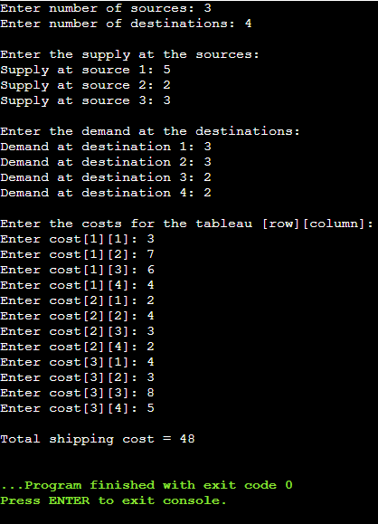

# Transportation Problem Solver

A console application in C++ that solves the **Transportation Problem** using the **North-West Corner Method**. This project was completed as a course assignment for **MATH 329: Operations Research**.

## Screenshot



---

## The Problem

The Transportation Problem is a classic linear programming problem aimed at finding the most cost-effective way to distribute goods from various sources to different destinations. The goal is to minimize the total shipping cost while satisfying all supply and demand constraints.

---

## The Solution

This program implements the **North-West Corner Method** to find an initial **Basic Feasible Solution (BFS)**. The method is a systematic, step-by-step algorithm that begins at the top-left cell of the transportation tableau (the "north-west corner") and allocates as much as possible to that cell before moving to the next one.

The application prompts the user to input the number of sources, destinations, and the corresponding supply, demand, and cost data. It then calculates and displays the total cost of the initial solution.

---

## How to Run

1.  **Compile the code:**
    ```bash
    g++ -o transport_solver main.cpp
    ```
    (Note: Assuming your C++ file is named `main.cpp`. You can use any C++ compiler like `g++`.)

2.  **Run the executable:**
    ```bash
    ./transport_solver
    ```
3.  **Follow the on-screen prompts** to enter your problem data.

---
